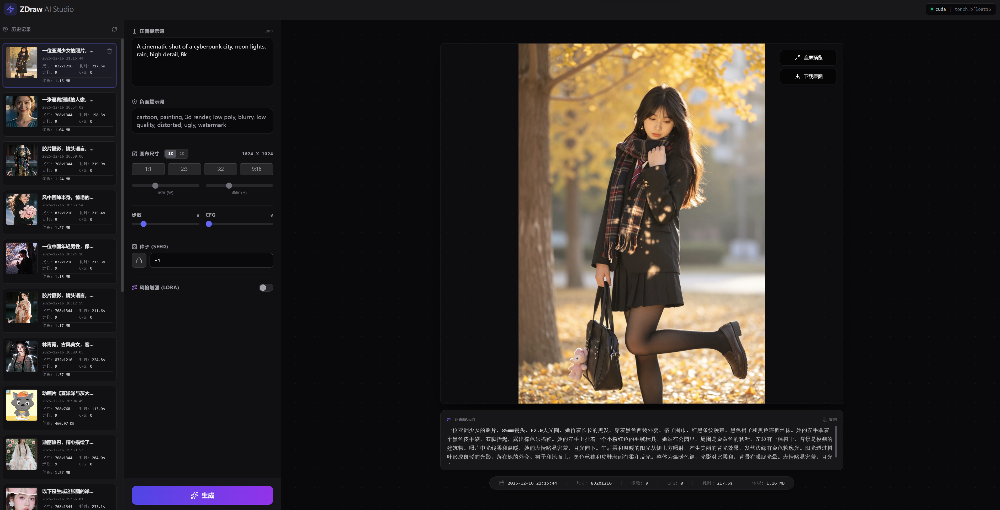

# ZDraw AI Studio

## 1. 介绍
ZDraw AI Studio 是一个基于 [Tongyi-MAI/Z-Image-Turbo](https://modelscope.cn/models/Tongyi-MAI/Z-Image-Turbo) 模型的本地 AI 绘画工作站。它集成了高性能的推理引擎和直观的 Web 界面，支持文本生成图像（Text-to-Image）及 LoRA 模型扩展。

### 界面预览
<div align="center">
   
   
   
</div>

项目特点：
- **高性能**：基于 Turbo 模型，支持 8 步快速推理。
- **本地化**：完全本地运行，保护隐私。
- **易用性**：一键启动 WebUI，无需复杂配置。
- **自动管理**：支持运行时自动下载缺失的模型文件。

## 2. 本地部署方案

请确保已安装 Python 3.10+ 及 Git。

### 2.1 使用 NVIDIA RTX 系列 GPU 推理（推荐）
这是推荐的运行方式，能够获得最佳的性能体验。

1. **克隆项目**
   ```bash
   git clone https://github.com/crazyma99/ZDraw-AI-Studio.git
   cd ZDraw-AI-Studio
   ```

2. **安装依赖**
   建议使用虚拟环境（如 venv 或 conda）。
   ```bash
   # 安装 PyTorch (建议根据自己的 CUDA 版本访问 pytorch.org 获取安装命令，以下为示例)
   pip install torch torchvision torchaudio --index-url https://download.pytorch.org/whl/cu128
   
   # 安装项目依赖
   pip install -r requirements.txt
   ```

3. **(可选) 安装 Flash Attention 加速**
   Flash Attention 可以显著提高推理速度并减少显存占用。
   
   *   **官方仓库**: [Dao-AILab/flash-attention](https://github.com/Dao-AILab/flash-attention)
   *   **安装方法**:
       请确保已安装 CUDA Toolkit（通常在 PyTorch 安装时包含，或者需要单独安装完整的 CUDA 开发包）。
       ```bash
       pip install flash-attn --no-build-isolation
       ```
       *注意：在 Windows 上编译可能较为复杂，建议寻找对应 Python 和 CUDA 版本的预编译 whl 包进行安装。*

   *   **自动启用**:
       本项目已内置自动检测机制。只要成功安装了 `flash-attn`，程序启动时会自动检测并启用 `Flash Attention 3` (优先) 或 `Flash Attention 2`。

4. **启动服务**
   ```bash
   python main.py
   ```

### 2.2 使用 CPU 推理（不推荐）
如果没有 NVIDIA 显卡，可以使用 CPU 运行，但速度会显著变慢。

1. **安装依赖**
   ```bash
   pip install torch torchvision torchaudio
   pip install -r requirements.txt
   ```

2. **启动服务**
   ```bash
   python main.py
   ```
   程序会自动检测设备，若无 GPU 则回退至 CPU 模式。

## 3. 模型下载

### 3.1 运行时自动下载
首次运行 `python main.py` 时，系统会自动检测 `Z-Image-Turbo` 目录。如果目录不存在或为空，程序将自动调用 `modelscope` 下载模型文件。

### 3.2 手动下载
如果您所处的网络环境无法直接连接 ModelScope，可以选择手动下载模型。

1. 访问模型主页：[https://www.modelscope.cn/models/Tongyi-MAI/Z-Image-Turbo/](https://www.modelscope.cn/models/Tongyi-MAI/Z-Image-Turbo/)
2. 将所有模型文件下载至项目根目录下的 `./Z-Image-Turbo/` 文件夹中。
   
   目录结构应如下所示：
   ```
   ZDraw-AI-Studio/
   ├── Z-Image-Turbo/
   │   ├── model_index.json
   │   ├── scheduler/
   │   ├── text_encoder/
   │   ├── ...
   ├── main.py
   ├── requirements.txt
   └── ...
   ```
